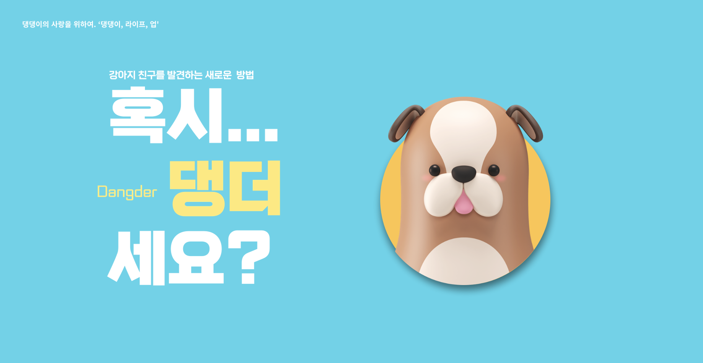
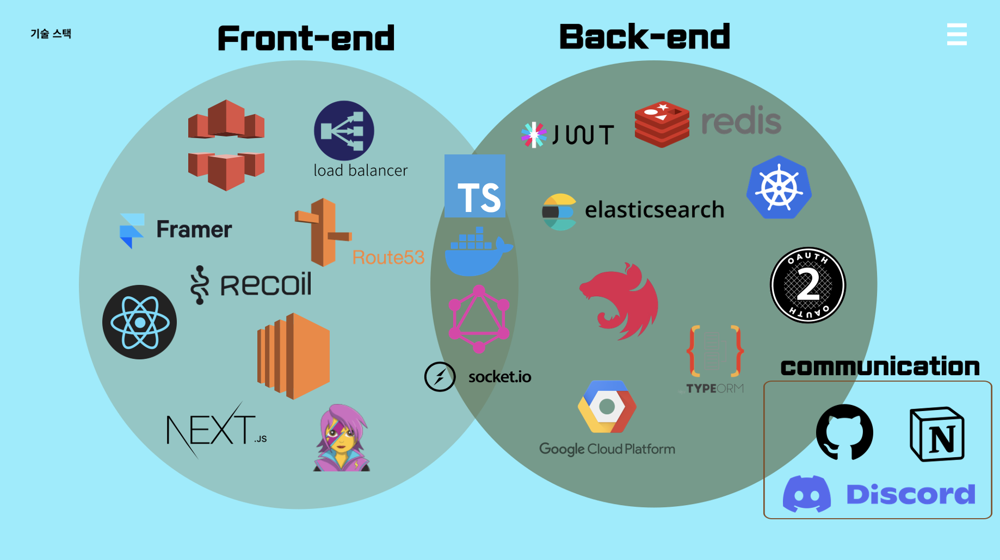
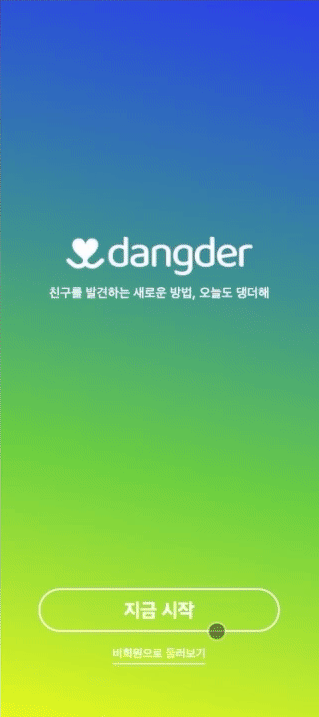
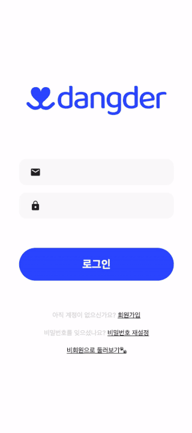
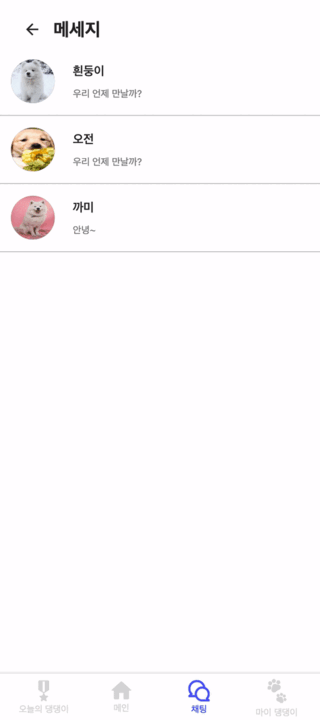

  

 <h1>댕더(Dangder)</h1>
 <h4>혹시.. 댕더세요? ❤️</h4>
 
댕댕이의 사랑을 위하여. ‘댕댕이, 라이프, 업' - Dangder🔥

## 💬 서비스 소개

 

860만 반려동물 시대를 맞이한 대한민국! ([기사](https://www.korea.kr/news/pressReleaseView.do?newsId=156448339)) 🐶 애견인들은 이미 다양한 커뮤니티 안에서 여러 활동을 하고 있습니다. 반려동물의 다양한 경험과 활동을 위해 열심을 다하는 애견인들을 위한 프로젝트 🐾 **‘Dangder’** (댕더)는 반려견의 Play-Mate 를 찾아 함께함을 통해 반려견(댕댕이) ‘멍라밸'의 질을 높이기 위한 서비스로, 친구와 함께 할 때 더 즐거워하는 사랑스러운 우리 댕댕이들을 위해 플랫폼을 통해 산책, 간식, 애견카페(애견수영장, 애견캠핑 등..) 탐방을 함께 할 친구를 찾고, 서로 마음이 맞는 친구를 매칭시켜 채팅을 통해 함께 만나 볼 수 있는 기능을 제공하여 더 행복한 멍라벨을 누릴 수 있도록 지원하는 애견인과 댕댕이를 위한 프로젝트입니다. 🦴

## 😎 멤버 소개

|                                          Frontend                                          |                                          Frontend                                           |                                          Frontend                                          |                                          Backend                                          |                                          Backend                                          |                                          Backend                                           |
| :----------------------------------------------------------------------------------------: | :-----------------------------------------------------------------------------------------: | :----------------------------------------------------------------------------------------: | :---------------------------------------------------------------------------------------: | :---------------------------------------------------------------------------------------: | :----------------------------------------------------------------------------------------: |
|  |  |  |  |  |  |
|                           [현혜진](https://github.com/hyejineee)                           |                          [권민철](https://github.com/kwonminchul)                           |                           [이지혜](https://github.com/leedawnn)                            |                           [김반석](https://github.com/banssss)                            |                           [최현웅](https://github.com/justkod)                            |                            [김영후](https://github.com/poagg42)                            |

## ⚙️ 기술 스택

## 🐶 시연 영상

### 1. Intro

### 2. 로그인

### 3. 비회원 둘러보기

### 4. 회원가입 및 초기 프로필 설정

   &nbsp; &nbsp; &nbsp; 
  

### 5. 메인 페이지(좋아요/skip 스와이프)

### 6. 댕더 패스권

### 7. 상세 페이지

### 8. 오늘의 댕댕이

### 9. 채팅방 목록

### 10. 채팅

// gif 넣을 예정

### 11. 문의하기

